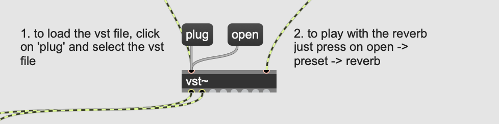

# Title
One

## Description
Humans are not solitary beings. We need one another to thrive and evolve. Yet, somewhere along the way, we’ve forgotten our innate interdependence — both with each other and with the world that surrounds us. “One” is an interactive installation designed to rekindle this sense of connection, encouraging people to collaborate in order to create a shared experience. 

“One” features a large, tactile surface that participants are invited to explore. Touching its conductive elements activates visual effects inspired by natural elements, accompanied by a gentle soundscape. The true experience lies in the heart of collaboration. 

## Prerequisites
1. Install Max, Touchdesigner, and Arduino. 
2. Make sure you have an Arduino Uno board.
3. Clone this repository on your local machine and enter in the sounds subfolder and install ValhallaSupermassive. Open the Max patch, drag and drop P_4L II.amxd (also found in the sounds folder) into the missing component. Now add the reverb component installed previously by clicking on the plug component (see image below), selecting the vst Valhalla file, and then clicking open. From there you can choose your own reverb ! Just play with it and find out what sounds the best for you.

4. Create some interactive buttons (...)

5. Wire up. Use the first 6 digital pins on your board (2-7, the first 2 pins are reserved for something else), along with GND and attach them to each of the buttons carefully.

## Installing

## Usage
Find a table and a projector, plug in Arduino, open up Touchdesginer and Max (don't forget to press on trigger to activate it) and watch the magic happen. Play with it, touch some buttons at the same time, compose music with the them, or play twister on the table (be careful not to break it).

## (Links)
...

