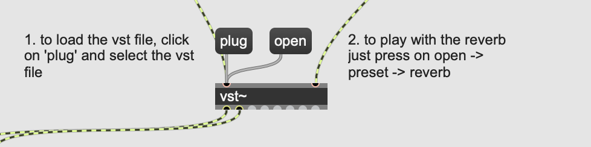
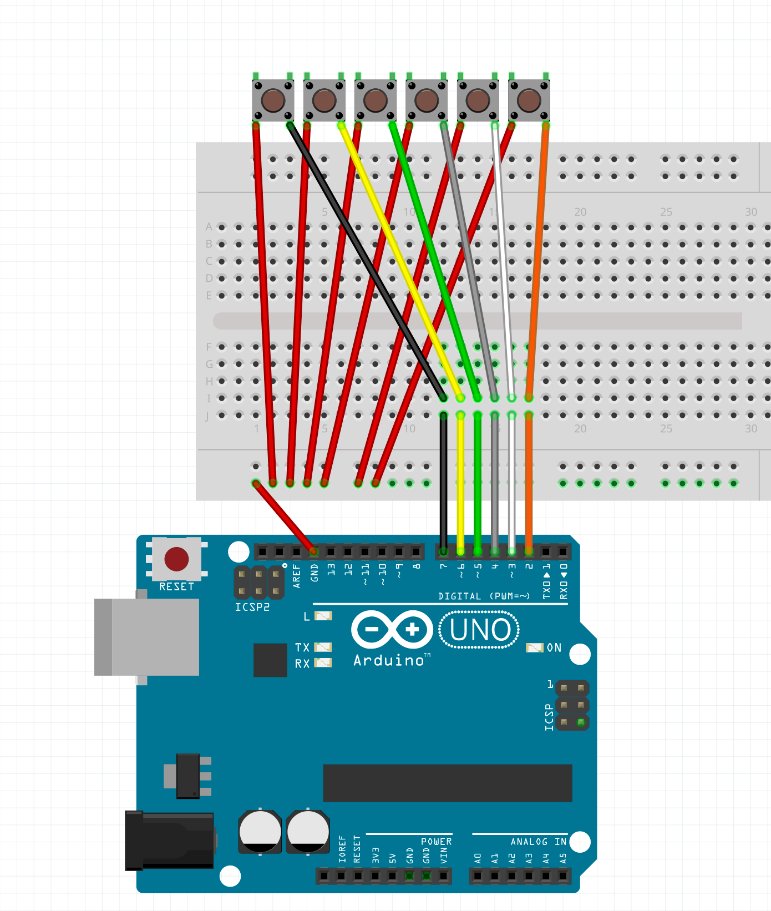

# Title
One

## Description
Humans are not solitary beings. We need one another to thrive and evolve. Yet, somewhere along the way, we’ve forgotten our innate interdependence — both with each other and with the world that surrounds us. “One” is an interactive installation designed to rekindle this sense of connection, encouraging people to collaborate in order to create a shared experience. 

“One” features a large, tactile surface that participants are invited to explore. Touching its conductive elements activates visual effects inspired by natural elements, accompanied by a gentle soundscape. The true experience lies in the heart of collaboration. 

## Prerequisites
Make sure you have Max, Touchdesigner, Arduino, an Arduino Uno board, some wires and some velostat material.

## Installing
1. Clone this repository on your local machine and enter in the sounds subfolder and install ValhallaSupermassive (sounds/ValhallaSupermassiveOSX_4_0_0v4.dmg). Open the Max patch, drag and drop P_4L II.amxd (also found in the sounds folder) into the missing component. Now add the reverb component installed previously by clicking on the plug component (see image below), selecting the vst Valhalla file, and then clicking open. From there you can choose your own reverb ! Just play with it and find out what sounds the best for you.

2. Create some interactive buttons. Cut 2 pieces of cardboard (or any non-conductive sheet) to form the base and top. Cut 2 small pieces of aluminium foil, or anything conductive (they need to be smaller in size than the cardboard pieces). Last but not least, you need to cut one piece of velostat, same size as the foil. Glue the foil pieces on the center of each cardboard piece. On one of the cardboard pieces attach the velostat foil, make sure to center it. The inside of the button should look something like this:

Repeat for the next buttons.
3. Wire up. Use the first 6 digital pins on your board (2-7, the first 2 pins are reserved for something else), along with GND and attach them to each of the buttons carefully. It should look something like this:

The GND wire goes onto the cardboard without the velostat piece while the digital pin goes onto the other.

## Usage
Find a table and a projector, plug in the Arduino board, open up Touchdesginer and Max (don't forget to press on trigger to activate it) and watch the magic happen. Play with it, touch some buttons at the same time, compose music with them, or play twister on the table (be careful not to break it).

